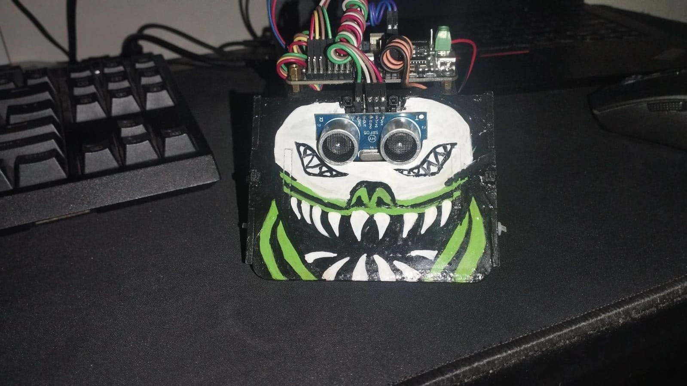

# Gerardo - Sumobot 2026

## Intro

Gerardo is a competitive sumo robot built for a robotics tournament, developed by the LeonBots team (Liceo León Cortés Castro, Grecia, Alajuela). The robot detects its opponent and the edge of the ring, and executes autonomous maneuvers to push the opponent out while avoiding falling off itself.

The base hardware kit reference comes from Universidad Cenfotec's public repository. The firmware itself is developed by this team.

## 🛠️ Technologies

- ESP32-WROOM-32E
- C++
- Arduino Framework
- PlatformIO
- VS Code
- HY-SRF05 (Ultrasonic Sensor)
- LSM6DS3TRC (IMU)
- NeoPixel

## Features

- Edge detection using 4 IR sensors with double-read filtering to reduce false positives
- Opponent detection via ultrasonic sensor with median filtering
- Precise rotation using gyroscope data from the IMU
- Impact detection using accelerometer data
- Chassis lift detection
- Anti-loop system to prevent repeating the same failed maneuver
- 3-round match state machine with LED round indicators
- Escape maneuvers when an edge is detected (forward, left push, right push)
- Non-blocking timing throughout (no blocking `delay()` calls during maneuvers)

## Process

I started this project as a CircuitPython prototype, which I used to validate sensor behavior and basic combat logic like the round state machine, edge detection, and escape maneuvers. Once that was working, I fully ported the codebase to C++ using the Arduino framework and PlatformIO, which is now my main development line. Along the way I confirmed and corrected motor wiring and polarity through physical testing, since the motors were initially swapped and had incorrect polarity in code. I also refactored everything into a modular architecture, splitting responsibilities into separate files instead of one large script. Sensor behavior for the IR, ultrasonic, and IMU sensors was tuned empirically through repeated physical testing, since calibration values are hardware-specific and noisy. Issues like motor braking, blocking delays causing freezes, stale state after escape maneuvers, and brownout resets on battery power came up during testing, and I fixed them one at a time as I found them.

## How This Can Be Improved

- **Brownout on battery power** is only partially mitigated in software (adjusted brownout threshold). A hardware fix is recommended: add a capacitor near the power input, and/or upgrade to a battery with better discharge characteristics (e.g. Energizer Ultimate Lithium).
- **IR sensor IO34** has shown inconsistent readings across multiple test sessions and may need to be replaced or re-calibrated.
- **Attack strategy** is currently reactive (respond to opponent detection); a more proactive/predictive strategy could improve match performance.
- **Test coverage** could be expanded with a dedicated test file for isolating and tuning specific maneuvers, similar to what was used during CircuitPython development.
- Consider adding unit-level sanity checks (startup self-test) to confirm all sensors are responding correctly before a match starts.

## How to Run the Code

1. Clone this repository
2. Open the project folder in VS Code
3. Let PlatformIO install dependencies (first run only)
4. Connect the ESP32 board via USB
5. Select the correct port in PlatformIO
6. Click Upload
7. Open the Serial Monitor to confirm it's running

## Photo of Gerardo

  

