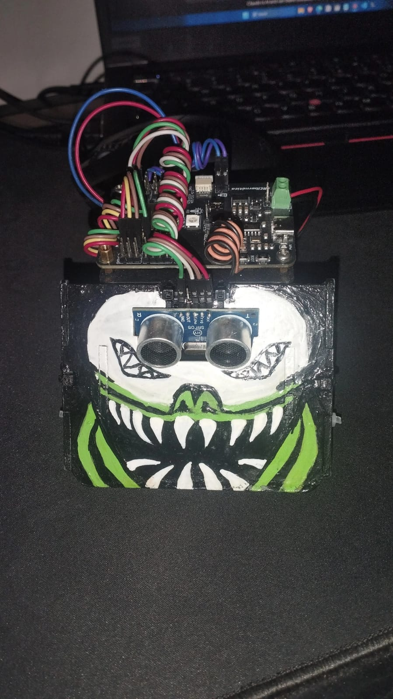

# Gerardo — Sumobot 2026

Robot de sumo competitivo desarrollado para torneo de robótica, como parte del proyecto **LeonBots** del Liceo León Cortés Castro (Grecia, Alajuela, Costa Rica).

> El kit de hardware base utilizado proviene del repositorio público de **Universidad Cenfotec** (ver sección de Repositorios), no de la institución del equipo.

## 📸 El robot

<p align="center">
  
  <br />
  
</p>


---

## 📋 Descripción

Gerardo es un robot de sumo autónomo diseñado para detectar y empujar a su oponente fuera del dohyo, evitando salirse del área de combate. El sistema combina sensores infrarrojos de borde, sensor ultrasónico de detección de oponente, e IMU para maniobras de precisión y detección de impacto.

El proyecto originalmente se desarrolló en CircuitPython y actualmente está siendo portado por completo a **C++ (Arduino framework / PlatformIO)**, que es la línea de desarrollo activa.

## 🔧 Especificaciones de Hardware

| Componente | Detalle |
|---|---|
| Microcontrolador | ESP32-WROOM-32E |
| Motor M1 | IO14 + IO12 |
| Motor M2 | IO13 + IO15 |
| Sensores IR (borde) | IO36, IO39, IO34, IO35 |
| Sensor ultrasónico | HY-SRF05 |
| IMU | LSM6DS3TRC (I2C, dirección `0x6B`) |
| NeoPixel (indicador de ronda) | IO2 |
| Botón de inicio (BOOT) | IO0 |

> ⚠️ **Nota de hardware:** IO34 ha mostrado comportamiento inconsistente en algunas sesiones de prueba — ver sección de Troubleshooting.

## 📐 Arquitectura del código

El firmware en C++ está organizado en una arquitectura modular de 10 componentes:

```
config.h          → constantes y configuración global
boton             → manejo del botón de inicio
motores           → control de motores y polaridad
sensores_ir       → detección de borde (doble lectura con filtro)
ultrasonico       → detección de oponente (filtro de mediana)
imu               → rotación por giroscopio, detección de impacto por acelerómetro
movimiento        → lógica de movimiento base
led               → señalización de ronda vía NeoPixel
maniobras         → secuencias de escape y ataque
estado_juego      → máquina de estados de 3 rondas
```

### Polaridad de motores (confirmada en hardware)

| Movimiento | M1 | M2 |
|---|---|---|
| Adelante | -1.0 | 1.0 |
| Reversa | 1.0 | -1.0 |
| Giro derecha | -1.0 | -1.0 |
| Giro izquierda | 1.0 | 1.0 |

## 🚀 Estado actual

- ✅ Port completo de CircuitPython a C++ (PlatformIO / Arduino framework)
- ✅ Refactor a arquitectura de 10 módulos
- ✅ Rotación precisa por giroscopio
- ✅ Detección de impacto por acelerómetro
- ✅ Detección de levantamiento de chasis
- ✅ Sistema anti-loop
- 🟡 Mitigación de brownout en batería (parcial vía software — pendiente fix de hardware: capacitor / batería Energizer Ultimate Lithium)

## ⚙️ Instalación y setup

### Requisitos previos
- [Visual Studio Code](https://code.visualstudio.com/)
- Extensión [PlatformIO](https://platformio.org/) instalada en VS Code
- Cable USB con soporte de datos (no solo carga)
- Driver USB-to-Serial (CP2102 o CH340, según el módulo)

### Pasos
1. Clonar este repositorio
2. Abrir la carpeta del proyecto directo en VS Code
3. PlatformIO detectará automáticamente `platformio.ini` e instalará las dependencias del framework Arduino para ESP32
4. Confirmar la versión del ESP32 Arduino core instalada — versiones distintas cambian la API de funciones PWM (`ledcAttach` y similares)
5. Conectar la placa por USB y verificar el puerto correcto en la barra inferior de VS Code
6. Usar el botón **Upload** de PlatformIO para compilar y flashear
7. Si el flasheo no inicia automáticamente, mantener presionado el botón **BOOT** (IO0) durante la carga

## 🐛 Problemas conocidos

| Error | Causa | Solución |
|---|---|---|
| Error de compilación en funciones PWM | Cambio de API entre versiones del ESP32 Arduino core (2.x vs 3.x) | Verificar versión del core instalado antes de usar referencias de tutoriales viejos |
| Robot se congela en maniobra de escape | Uso de `delay()` bloqueante | Usar temporización no-bloqueante basada en `millis()` |
| Robot repite estado de búsqueda viejo tras escapar de un borde | Variables de estado no reseteadas tras la maniobra | Resetear variables de estado al iniciar/terminar cada maniobra |
| Reinicios random en batería (funciona bien en USB) | Brownout del ESP32 por caída de voltaje al activar motores | Software: ajustar umbral de brownout. Hardware: capacitor + batería de mejor descarga |
| Lecturas IR inconsistentes / falsos bordes | Ruido análogo, sensor IO34 identificado como problemático | Doble lectura con filtro antes de decidir |

## 📓 Historial de versiones

Este proyecto sigue un versionado simple:
- **Número entero** (`6`, `7`...) → refactor grande o cambio de arquitectura
- **Decimal** (`6.1`, `6.2`...) → fix o ajuste menor sobre esa versión base

Ver [CHANGELOG.md](./CHANGELOG.md) para el historial detallado de cambios.

## 👥 Autor

Código desarrollado por [tu nombre] — equipo **LeonBots**, Liceo León Cortés Castro (Grecia, Alajuela).

## 📄 Licencia

Proyecto académico — uso educativo.
